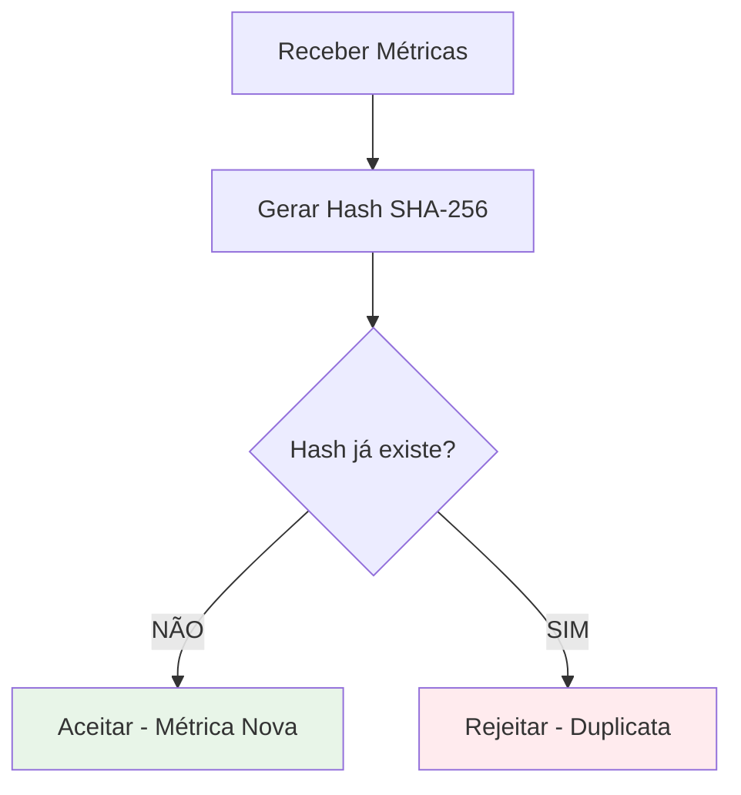

# 🔄 Estratégia de Deduplicação - Servidor de Indicadores

## 🎯 **Problema**

Em ambientes CI/CD, métricas podem ser enviadas múltiplas vezes devido a falhas de rede, reprocessamento de builds ou execuções manuais, resultando em **dados duplicados** e **relatórios incorretos**.

## 💡 **Solução: Deduplicação Baseada em Hash**

### **Conceito Central**
Gerar um **identificador único (hash SHA-256)** baseado no conteúdo das métricas para detectar duplicações antes do armazenamento.

### **Campos Utilizados no Hash**
```
Hash = SHA256(
  projectId +
  timestamp (truncado para minutos) +
  métricas básicas (lines, functions, classes, comments) +
  dependências (quantidade + lista ordenada) +
  resumo de indentação (arquivos totais, qualidade média)
)
```

### **Estratégia de Normalização**
- **Incluir:** Dados que refletem qualidade do código
- **Excluir:** Metadados que podem variar (nomes de arquivos, caminhos)
- **Resumir:** Informações detalhadas em métricas agregadas

## 🔍 **Fluxo de Funcionamento**



### **Lógica Simplificada**
**Princípio:** Hash idêntico = conteúdo idêntico = duplicata

- ✅ **Hash diferente:** Sempre aceitar (dados realmente mudaram)
- ❌ **Hash igual:** Sempre rejeitar (dados exatamente iguais)

**Obs:** O timestamp é truncado para minutos no hash, evitando diferenças por segundos/milissegundos.

## 📊 **Cenários de Validação**

| Cenário | Resultado | Motivo |
|---------|-----------|---------|
| **Dados idênticos** enviados em 1 minuto | ❌ Rejeitado | Hash igual + janela temporal |
| **Dados idênticos** enviados após 10 minutos | ❌ Rejeitado | Hash igual = conteúdo duplicado |
| **Nova dependência** adicionada | ✅ Aceito | Hash diferente |
| **Indentação corrigida** | ✅ Aceito | Resumo de qualidade mudou |
| **Mesmo código, timestamp diferente** | ❌ Rejeitado | Hash igual independente do tempo |

## 🛠️ **Implementação Técnica**

### **Armazenamento de Controle**
```sql
CREATE TABLE metric_hashes (
    hash_value VARCHAR(64) UNIQUE,  -- SHA-256
    project_id UUID,
    created_at TIMESTAMP,
    UNIQUE(hash_value)
);
```

### **Algoritmo de Verificação**
1. **Normalizar** dados de entrada (excluir timestamp dos segundos)
2. **Gerar hash** SHA-256 do conteúdo
3. **Verificar** se hash já existe no banco
4. **Se existe:** Rejeitar como duplicata
5. **Se não existe:** Aceitar e armazenar hash

### **Limpeza Automática**
- **Frequência:** Diária
- **Critério:** Hashes > 30 dias
- **Objetivo:** Controlar crescimento da tabela

## 🎓 **Conceitos Acadêmicos Aplicados**

### **Estruturas de Dados**
- **Hash Tables:** Busca O(1) para verificação de duplicatas
- **Índices B-tree:** Otimização de consultas temporais

### **Algoritmos**
- **SHA-256:** Função de hash criptográfica para fingerprinting
- **Normalização:** Processamento determinístico de dados

### **Engenharia de Software**
- **Separação de responsabilidades:** Módulo dedicado à deduplicação
- **Testabilidade:** Casos de teste para validação da lógica

### **Vantagens**
- Elimina duplicações efetivamente
- Mantém integridade dos dados
- Performance adequada para escala média

---

## 🎯 **Conclusão**

A estratégia de deduplicação baseada em hash SHA-256 resolve efetivamente o problema de métricas duplicadas, aplicando conceitos fundamentais de **estruturas de dados**, **algoritmos** e **engenharia de software** de forma prática e escalável, adequada tanto para ambientes acadêmicos quanto de produção.